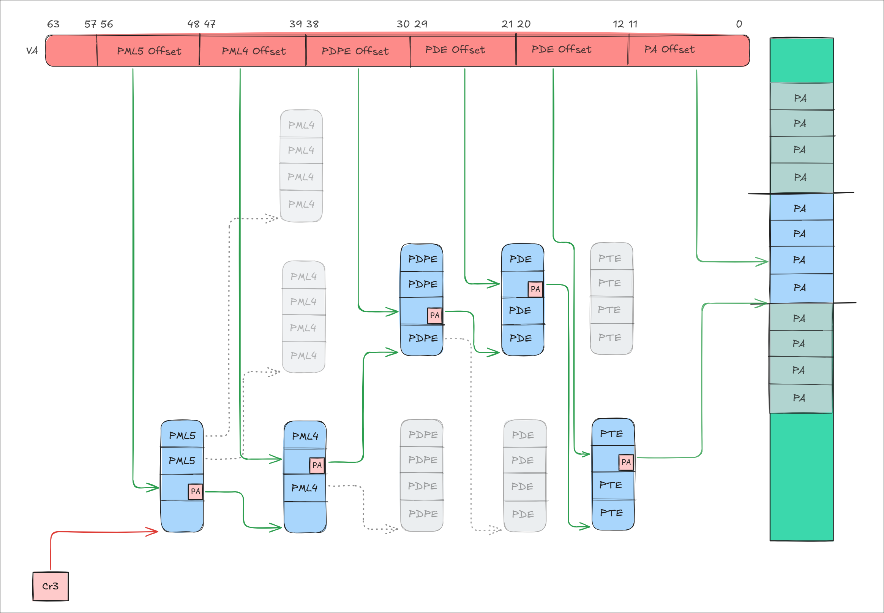
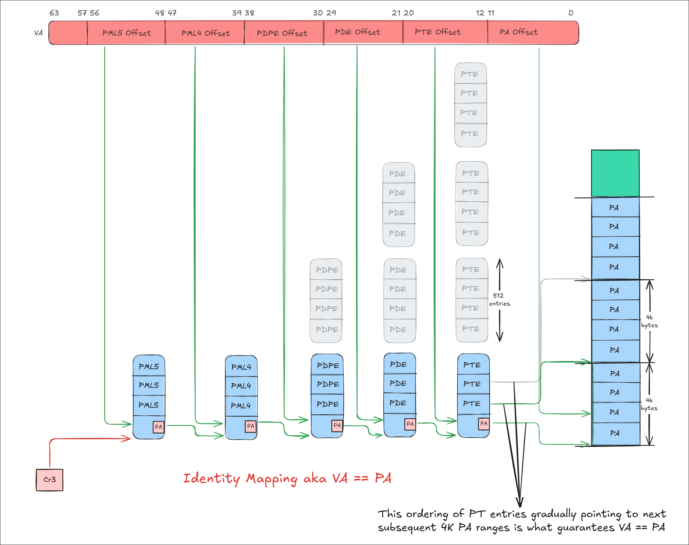
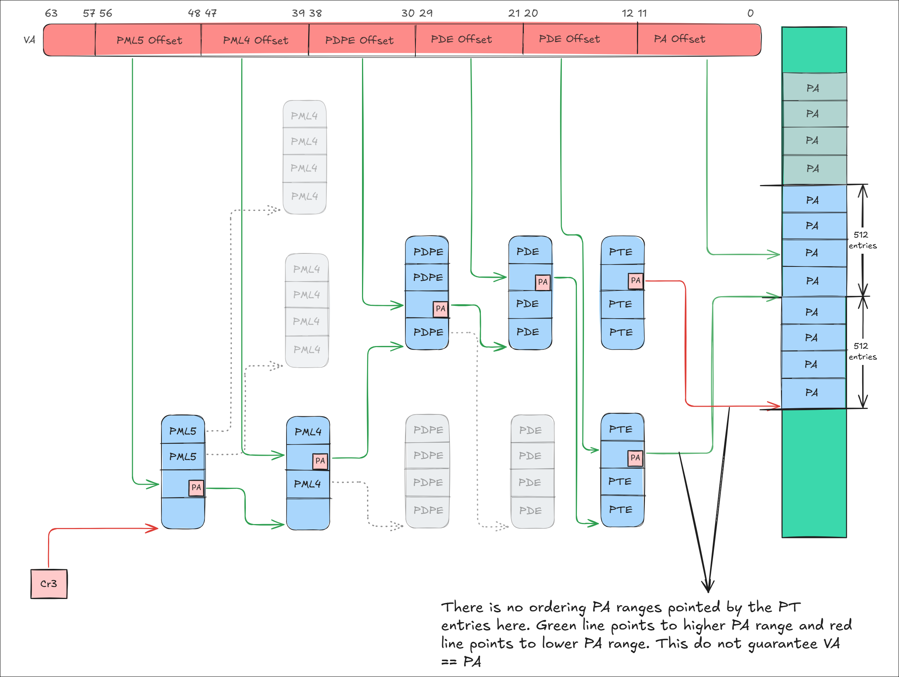
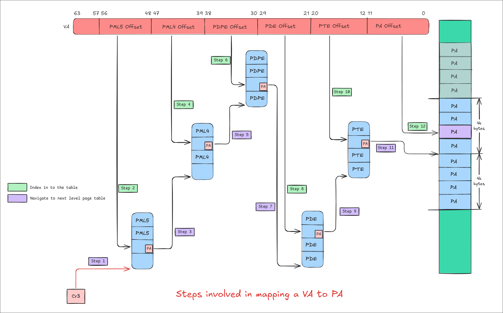
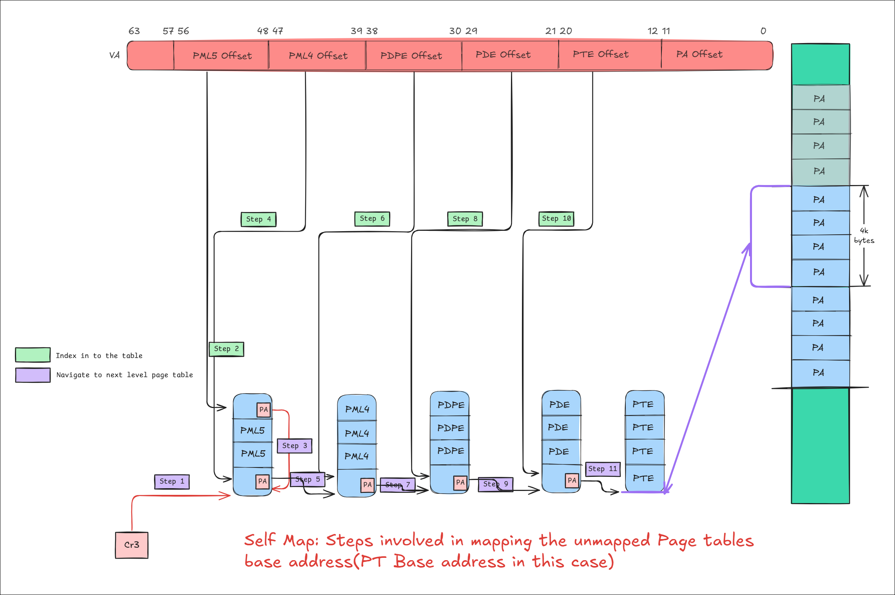
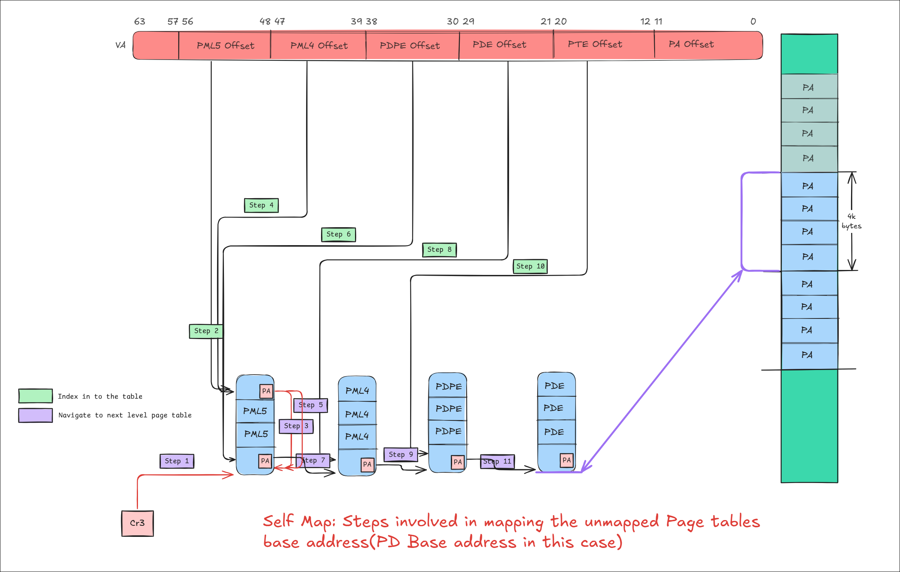
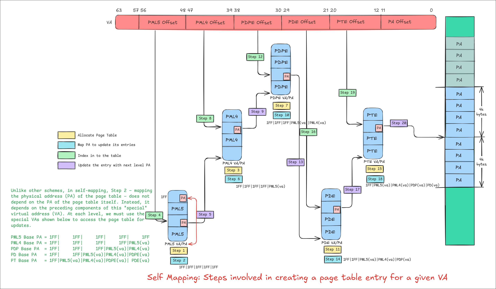

# Paging/Identity Mapping/Self Mapping 101

> Note: This document is intended to broadly cover the general concepts related
> to paging, not necessarily the way this crate implements it. While it
> generally follows the current implementation in the crate, that is not the
> primary expectation. It also discusses the concepts with x64 architecture and
> 5 level paging in mind.

## What is memory mapping?

Memory mapping, in the context of paging, refers to the ability of the CPU to
*decode* a virtual address (VA) into a physical address (PA) by successfully
walking the page tables. When this happens, we say that the given VA has a PA
mapping. If, for some reason, the CPU is unable to walk the page tables, it will
raise a page fault exception. In other words, the VA is not mapped(unmapped).

## How is a Virtual Address (VA) decoded into a Physical Address (PA)?

For example x64 CPUs break the given VA in to below components(assuming 5 Level
paging)

```text
  63           57 56           48 47           39 38           30 29            21 20            12 11               0
  ┌──────────────┬───────────────┬───────────────┬───────────────┬────────────────┬────────────────┬──────────────────┐
  │ Sign         │  PML5E        │ PML4E         │Page Directory │ Page           │ Page           │Physical          │
  │ Extend       │  Offset       │ Offset        │Pointer        │ Directory      │ Table          │Page              │
  │              │               │               │Offset         │ Offset         │ Offset         │Offset            │
  └──────────────┴───────────────┴───────────────┴───────────────┴────────────────┴────────────────┴──────────────────┘

0x0000123456789012 :
       |     PML5|     PML4| PDP     |  PD     |  PT     |    Physical
0000000|000000000|000100100|011010001|010110011|110001001|000000010010
      0|        0|       24|       D1|       B3|      189|          12 Hex
```

The CPU uses these components as indexes into the page tables. It starts with
the PML5 component, which is 0 in this case, and indexes into the 0th entry of
the PML5 page table. This 0th entry contains the physical address (PA) of the
PML4 page table base. Next, the CPU uses the PML4 component of the VA (which is
0x24) and indexes into the corresponding PML4 page table. This process continues
through each level—PDP, PD, and PT—until the CPU finally reaches the physical
page offset (bits 0-11).In addition to this, each Page Table Entry (PTE)
contains memory protection-related bits (not covered in this document).

The illustration below showcases the page table walk performed by the CPU.



## What does a page table contain(x64)?

Each page table is 4KB in size and each entry with in the page table is of 8
bytes(64 bits). Below is the general structure of the page table entry in X64.
Because of this each page table will have 512 entries(2^9). Hence in the above
VA to PA translation the virtual address is broken down in to 9 bit components.
The table base-address field points to the physical base address of the
next-lower-level table in the page-translation hierarchy.


## What does setting up of Page tables involve?

Setting up the above-illustrated page tables requires creating the necessary
page tables and appropriately wiring them together so that the CPU can perform
the VA-to-PA translation. This means that setting up the page tables is not free
— the page tables themselves take up memory. Additionally, that memory must be
*accessible and mapped* prior to setting them up; otherwise, any read or write
access performed on those page tables during setup could lead to page faults.

Once the page tables are set up, the CPU will always access them using their
physical addresses (PAs), not virtual addresses (VAs), so there will be no
question of whether those pages are mapped. Again, this restriction — that page
tables must already be mapped — applies only to us, the programmers, when making
changes to them during setup.

### Quick Detour of x64 Processor Modes

1. **Real Mode:** No paging, and there is no concept of virtual addresses (VA)
   or protection. Everything is accessible (meaning everything is already
   mapped).
2. **32-bit Protected Mode with Segmentation (without Paging, optional):** No
   paging is involved. Everything is still accessible up to 4GB, provided the
   segment descriptors are appropriately configured.
3. **32-bit Protected Mode with Segmentation and Paging:** This is the first
   time any kind of paging or page tables are set up. During this setup, we are
   still in 32-bit protected mode (without paging) and have access to memory, so
   we can set up the page tables as needed.
4. **64-bit Long Mode with Segmentation and Paging (mandatory):** This is when
   we potentially reconfigure the paging and page tables a second time. Extra
   care should be taken to ensure that the pages used for building the page
   tables are already accessible and mapped in the current 32-bit protected mode
   with paging enabled. If so, we are good to proceed.

This is also the order in which the processor switches from one mode to the
next.

## What happens after enabling paging?

One of the problems we will run into immediately once paging is enabled is:
**how do we map new memory ranges?** Isn't it straightforward to simply walk the
existing page tables and add any intermediate page tables as required?

Unfortunately, no. Once paging is enabled, any memory allocated for a new page
table (say, at address `0x12345678`) will be treated as a virtual address. If we
try to write to the entries in that page table and if that page is not already
mapped, the CPU will trigger a page fault.

This leads to an endless loop of:
"Trying to map a new memory range → need page tables → trying to map page table
memory → need page tables → ..."

To avoid this, **when we create the page tables for the first time, we are**
**expected to map a sufficiently large chunk of memory upfront and perform a
careful dance**, which will later be used for setting up mappings for new memory
ranges.

## What are the different kinds of paging schemes?

We mainly consider below three type of paging schemes

1. Identity Mapping(VA always equals PA)
2. Non-Identity Mapping(VA need not alway equals PA)
3. Self Mapping(VA need not alway equals PA)

## What is Identity mapping?

Identity mapping in paging is a technique where virtual addresses are mapped
directly to the **same** physical addresses. By using identity mapping, the
system can access hardware and memory locations without dealing with non-trivial
address translation complexity. It is particularly useful during early system
initialization and when transitioning between different memory management modes,
such as moving from real mode to protected mode(in x64 architecture).



The important thing to note in the illustration is how the bottom-level page
tables are populated — starting with the lower memory locations and filling
their way up. Once all the entries in the first PT page table are occupied, we
move to the next PT page table, and then to the next PT page table, and so on -
up to 512 PT Page Tables (or, in other words, 512 PD entries in the first PD
page table). Once this is done, we move to the next PD page table, and so on.

```c
uint64_t pml4_table[ENTRIES_PER_TABLE]; // 512 entries
uint64_t pdpt_table[ENTRIES_PER_TABLE]; // 512 entries
uint64_t pdt_table[ENTRIES_PER_TABLE];  // 512 entries
uint64_t pt_table[ENTRIES_PER_TABLE];   // 512 entries

void setup_identity_paging() {
    // Clear all entries
    memset(pml4_table, 0, sizeof(pml4_table));
    memset(pdpt_table, 0, sizeof(pdpt_table));
    memset(pdt_table, 0, sizeof(pdt_table));
    memset(pt_table, 0, sizeof(pt_table));

    // Setup PML4 entry
    pml4_table[0] = ((uint64_t)pdpt_table) | PAGE_PRESENT | PAGE_RW;

    // Setup PDPT entry
    pdpt_table[0] = ((uint64_t)pdt_table) | PAGE_PRESENT | PAGE_RW;

    // Setup PDT entry
    pdt_table[0] = ((uint64_t)pt_table) | PAGE_PRESENT | PAGE_RW;

    // Setup PT entries for identity mapping only for the first 512 PT entries.
    // That results in 4K*512 bytes of memory range
    for (int i = 0; i < ENTRIES_PER_TABLE; i++) {
        pt_table[i] = (i * PAGE_SIZE) | PAGE_PRESENT | PAGE_RW;
    }
}

void load_page_table(uint64_t* pml4_table) {
    asm volatile("mov %0, %%cr3" : : "r"(pml4_table));
}

int main() {
    setup_identity_paging();
    load_page_table(pml4_table);
    return 0;
}
```

The limitation of a simple identity mapping setup is that if page tables for new
memory regions are not pre-allocated and mapped, adding new mappings becomes
difficult. This makes identity mapping more rigid compared to more flexible
memory mapping schemes.

## What is Non-Identity Mapping?

In this scheme, the internal wiring of page tables works very similar to
identity mapping; however, the wiring itself is non-deterministic because, in
non-identity mapping, the lower-level page tables (PTs) do not need to point to
contiguous or sequential memory ranges as they do in identity mapping. The
illustration below shows that the top PT page table points to a lower memory
region compared to the bottom PT page table. This causes the VA to not map
exactly to its PA.



## What is Self mapping?

**Self-mapping** is a clever way to create page tables that removes the
restriction of identity mapping. In other words, page tables for new memory
regions need not be pre-allocated and mapped.

Firstly, Self-mapping does not change the way the CPU resolves the *"normal"* VA
to PA translations once it is enabled. But it does change how the page tables
themselves are access and operated on. Meaning, how the page tables base address
are decoded and accessed is different. More on this later.

Secondly, the problem that self-mapping is trying to solve is, "**How can we poke
the page tables which are not mapped up front?**". This is where things get really
clever — and a bit mind-bending! Remember in order to wire up the intermediate
page tables we need to first allocate them or grab from a known location (which
was already mapped). This was always true in the prior mapping schemes. If
not they don't work.

However, now imagine that we allocated a page that was not already mapped (i.e.,
no VA-to-PA translation exists for that page table's base address). In order to
have read/write access to that page, we need to **trick** the CPU in such a way
that, when it resolves a specially crafted virtual address (VA), *the CPU's page
walk ultimately lands on the physical base address of the desired page table*.
What this means is that the CPU finishes translating the VA, but the page walk
itself ends at the desired page table. In other words, the CPU effectively maps
the page table for us, and we can then have R/W access to its entries. Remember what
"mapping" really mean? This paragraph definitely requires multiple readings to
fully grasp!

## What tricks are we playing with the CPU here?

Lets recap the usual VA to PA translation: Nothing new. Just follow Step 1 to
Step 12 in the below illustration. 

Imagine what happens to the CPU's address translation when the highest-level
page table's (PML5E) top-most entry (511 or 0x1FF — though it can be any entry)
is mapped to its own page table base, while leaving the rest of the page tables
at other levels unchanged. Now, if we try to access a special virtual address
(VA) shown below, interesting behavior emerges.

```text
0xFFFF000000000000 :
       |     PML5|     PML4| PDP/PML3|  PD/PML2|  PT/PML1|    Physical
6666555|555555544|444444443|333333333|222222222|211111111|110000000000
3210987|654321098|765432109|876543210|987654321|098765432|109876543210
1111111|111111111|000000000|000000000|000000000|000000000|000000000000
     7F|      1FF|        0|        0|        0|        0|           0 Hex
    127|      511|        0|        0|        0|        0|           0 Decimal
```

Compared to the previous illustration, in the self-mapping case, the final
address translation lands on the base address of the 0th PT (Page Table) instead
of landing on the physical frame. What does this mean? This means the CPU has
effectively mapped the **0th PT Page Table itself** using the special VA
`0xFFFF000000000000`. Take a deep breath and reread the previous sentence again!
Furthermore, the same logic can be applied to map the **2nd PT Page Table base** by
using the VA `0xFFFF000000200000`. So, **with just one self-referencing
(self-loop) entry in the PML5 page table, we gain access to all PT page tables**
simply by crafting appropriate virtual addresses. If we were to craft a VA like
`0xFFFFFF8000000000`, which loops back into the PML5 page table twice (why?
because `0xFFFFFF8000000000 = |1FF|1FF|0|0|0`), we would be able to **locate the PD
(Page Directory) page tables**, and so on for higher levels.

Let's walk through the page tables for these special VAs with some
illustrations.

Steps involved in mapping the unmapped PT Base address: Loop once


Steps involved in mapping the unmapped PD Base address: Loop twice


Below are special VAs which, when decoded by the CPU, will cause the
corresponding page tables to be mapped.

```text
                       | P | P |   |   |   |
                       | M | M | P |   |   |
                       | L | L | D | P | P |
                       | 5 | 4 | P | D | T |
-----------------------+---+---+---+---+---+-----------------------------
0xFFFFFFFFFFFFF000 =>  |1FF|1FF|1FF|1FF|1FF| => maps 0th PML5 Page table
0xFFFFFFFFFFE00000 =>  |1FF|1FF|1FF|1FF|  0| => maps 0th PML4 Page table
0xFFFFFFFFC0000000 =>  |1FF|1FF|1FF|  0|  0| => maps 0th PDP Page table
0xFFFFFF8000000000 =>  |1FF|1FF|  0|  0|  0| => maps 0th PD Page table
0xFFFF000000000000 =>  |1FF|  0|  0|  0|  0| => maps 0th PT Page table
```

The generalized formula for accessing any page table base is shown below. It is
an easier to understand formula if we perform a page walk with it manually.
Remember, 'va' is the new address that we are trying to map, and as part of the
process, we are trying to locate or map any necessary intermediate page tables.

```text
PT Base PA   = 1FF|PML5(va)|PML4(va)|PDPE(va)| PDE(va)| <--- If we loop 1 time and decode the rest of the address, we will get to appropriate PA base
PD Base PA   = 1FF|     1FF|PML5(va)|PML4(va)|PDPE(va)| <--- If we loop 2 times and decode the rest of the address, we will get to appropriate PD base
PDP Base PA  = 1FF|     1FF|     1FF|PML5(va)|PML4(va)| <--- If we loop 3 times and decode the rest of the address, we will get to appropriate PDP base
PML4 Base PA = 1FF|     1FF|     1FF|     1FF|PML5(va)| <--- If we loop 4 times and decode the rest of the address, we will get to appropriate PML4 base
PML5 Base PA = 1FF|     1FF|     1FF|     1FF|     1FF| <--- If we loop 5 times and decode the rest of the address, we will get to appropriate PML5 base
```

The key idea in the above formulas is that access to a lower-level page table
base depends only on the higher-level components of the va being mapped, not on
the physical address of the lower-level page table itself.

The above explanation assumes the self map is already enabled. Next we will see
how self mapped paging can be enabled

## Creating and enabling self-mapped paging

### Self mapping is not already enabled

When self-mapping is not active, the assumption is that the pages provided by
the allocator are already mapped. This is because, without self-mapping being
enabled (since CR3 points to non-self-mapped page tables), we cannot use the
self-mapping trick to modify those pages. As a result, we are required to have
those pages mapped in advance in order to wire them properly.

### Self mapping is already active

Once self-mapping is enabled (i.e., when CR3 is already updated to point to the
self-mapped page tables), any page tables needed to map new memory regions no
longer need to be pre-mapped. Since CR3 now references the self-mapped page
tables, we can leverage the trick to map and access the corresponding page table
bases, even if they have not been mapped yet.

## Steps involved in creating a page table entry for a given VA in Non-Identity mapping vs Self mapping

Steps involved in creating a page table entry for a given VA in Non-Identity
Mapping. At each level we have 4 primary steps

1. Allocate the page table itself (should already be mapped) - Yellow boxes
2. Map the VA to PA to update the newly allocated page table entries(by us) - Blue boxes
3. Extract the VA component for that level and index it into the page table - Green boxes
4. Update the entry with the lower-level page table's PA - Purple boxes


Steps involved in creating a page table entry for a given VA in Self Mapping.
Even here we have 4 steps to perform at each level. The only change is the 2nd
step is not based on the PA of the page table itself but based on the higher
level components of the VA being mapped.

1. Allocate the page table itself (should already be mapped) - Yellow boxes
2. *Map the PA using the specially crafted VA* to update the newly allocated page table entries(by us) - Blue boxes
3. Extract the VA component for that level and index it into the page table - Green boxes
4. Update the entry with the lower-level page table's PA - Purple boxes



## Key highlights/differences between self-mapping vs other schemes

1. For updating the page tables, We access the unmapped page tables at a given
   level with the help of carefully crafted special VA(which are created with
   higher level components of the actual VA to be mapped). In other schemes,
   page tables are accessed directly using their VA. **So in a way, the page
   table's physical base address(orange pa boxes) stored in the higher level do
   not matter for self mapping - Thats the point of using self mapping!**
2. The key difference from self-mapping arises only during the construction of
   new page tables for mapping new memory regions. Once the page tables are set
   up, for normal VAs, the CPU’s page walk behaves just like in any other scheme
   — no trickery is needed.
3. In essence, self mapping creates a virtual view of the physical page tables
   for easy manipulation.
